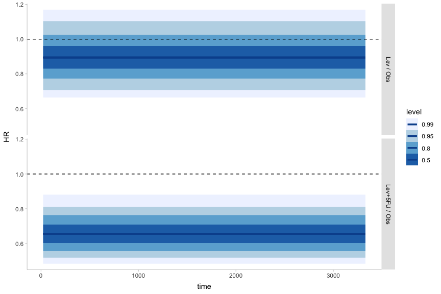

Marginal survival probabilities, marginal median survival and hazard
ratios from {brms} Weibull models
================
Lars Mølgaard Saxhaug

``` r
library(tidyverse)
library(survival)
library(brms)
library(tidybayes)
library(here)

theme_set(theme_tidybayes())
```

This started out as an exercice in plotting survival curves from `brms`,
including marginalising over baseline covariates, and expanded to
trialing the posibilities that lies in estimating effects for both
$scale$ and $shape$ in Weibull regression.

We will define som usefull functions for working with the Weibull
distribution, first median survival as $$scale(log(2)^{(1/shape)}) $$

``` r
median_weibull <- function(scale, shape) {
    (log(2)^(1/shape)) * scale
}
```

`brms` uses a $scale,shape$ parametrisation for the Weibull distribution
but the $shape$ is not estimated directly, rather $\mu$ is (which means
exponentiating coefficients yields mean time ratios). We convert $\mu$
and $shape$ to $scale$ as described
[here](https://stats.stackexchange.com/questions/542106/difference-in-fitting-to-right-censored-data-between-mle-and-bayesian-method),
using the formula $$scale = \frac{\mu}{\Gamma(1+\frac{1}{shape})}$$

``` r
weibull_mu_to_scale <- function(mu, shape) {
    mu/gamma(1 + 1/shape)
}
```

We also need the Weibull survival function to calculate and plot the
survival curves $$\displaystyle S(t)=e^{-(\frac{time}{scale})^{shape}}$$

``` r
weibull_survival <- function(scale, shape, time) {
    exp(-(time/scale)^shape)
}
```

Hazard function (for calculating hazard ratio) which is
$$\displaystyle \mathrm{h}(scale;shape;time)=\frac{shape}{scale}{(\frac{time}{scale})}^{scale-1}$$

``` r
weibull_hazard <- function(scale, shape, time) {
    (shape/scale) * (time/scale)^(shape - 1)
}
```

We’ll use the `colon` data from the `survival` package, focusing on the
mortality endpoint and the effect of `rx`, marginalising over other
covariates.

``` r
colon <- colon |>
  filter(etype == 2) |>
  mutate(
    censored = 1 - status, # brms uses 0 as non-censored, 1 as right censored
    across(rx, as.factor),
    across(sex,  ~ factor(., labels = c("Female", "Male"))),
    across(c(obstruct, perfor, adhere), as.factor),
    across(differ,  ~ ordered(., labels = c("well", "moderate", "poor"))),
    across(extent,  ~ ordered(., labels = c("submucosa", "muscle", "serosa", "contiguous structures"))),
    across(surg,  ~ ordered(., labels = c("short", "long")))
  ) |>   drop_na(rx,sex,age,nodes,differ,adhere,extent)
```

### Proprtional weibull regression

By only allowing $mu$ (and thus $scale$ parameter) to wary among
treatment groups, but with a constant common $shape$ parameter, we are
estimating a proportionoal hazards model. $shape$ determines whether the
hazards are decreasing when $shape<1$ (“infant mortality”) or increasing
(“aging”) when $shape>1$.

> Ordinal vaiables are handled as monotonic effects<sup>1</sup>

``` r
formula_scale_only <- bf(time | cens(censored) ~ rx + sex + age + nodes + mo(differ) +
    adhere + mo(extent), family = weibull)


prior_scale_only <- prior(normal(0, 2.5), class = b)


weibull_scale_only <- brm(formula = formula_scale_only, prior = prior_scale_only,
    data = colon, file = here("fits/weibull_scale_only.rds"), file_refit = "never")

weibull_scale_only
```

    ##  Family: weibull 
    ##   Links: mu = log; shape = identity 
    ## Formula: time | cens(censored) ~ rx + sex + age + nodes + mo(differ) + adhere + mo(extent) 
    ##    Data: colon (Number of observations: 888) 
    ##   Draws: 4 chains, each with iter = 2000; warmup = 1000; thin = 1;
    ##          total post-warmup draws = 4000
    ## 
    ## Population-Level Effects: 
    ##           Estimate Est.Error l-95% CI u-95% CI Rhat Bulk_ESS Tail_ESS
    ## Intercept     9.68      0.51     8.83    10.83 1.00     1877     1676
    ## rxLev         0.11      0.11    -0.10     0.33 1.00     3299     2452
    ## rxLevP5FU     0.41      0.12     0.19     0.64 1.00     3197     3061
    ## sexMale       0.03      0.10    -0.16     0.22 1.00     3651     2729
    ## age          -0.01      0.00    -0.01     0.00 1.00     5126     3193
    ## nodes        -0.09      0.01    -0.11    -0.07 1.00     3269     2663
    ## adhere1      -0.19      0.13    -0.44     0.06 1.00     3185     2503
    ## modiffer     -0.11      0.09    -0.28     0.09 1.00     2118     1992
    ## moextent     -0.42      0.16    -0.81    -0.18 1.00     1653     1671
    ## 
    ## Simplex Parameters: 
    ##              Estimate Est.Error l-95% CI u-95% CI Rhat Bulk_ESS Tail_ESS
    ## modiffer1[1]     0.35      0.25     0.02     0.94 1.00     2758     1833
    ## modiffer1[2]     0.65      0.25     0.06     0.98 1.00     2758     1833
    ## moextent1[1]     0.37      0.20     0.02     0.73 1.00     1710     1753
    ## moextent1[2]     0.43      0.18     0.13     0.80 1.00     2231     2348
    ## moextent1[3]     0.20      0.12     0.02     0.48 1.00     2513     1922
    ## 
    ## Family Specific Parameters: 
    ##       Estimate Est.Error l-95% CI u-95% CI Rhat Bulk_ESS Tail_ESS
    ## shape     1.04      0.05     0.95     1.13 1.00     3306     2677
    ## 
    ## Draws were sampled using sample(hmc). For each parameter, Bulk_ESS
    ## and Tail_ESS are effective sample size measures, and Rhat is the potential
    ## scale reduction factor on split chains (at convergence, Rhat = 1).

We then estimate the expected the survival probability and hazard for
each treatment group at each time point, marginalising over the
population in the style of the `comparisons` function from the
`marginaleffects` package.

``` r
proportional_posterior <- weibull_scale_only |>
  linpred_draws(
    marginaleffects::datagridcf(rx = levels(colon$rx), model = weibull_scale_only),    # duplicate the dataset for each treatment level
    value = "mu",
    transform = TRUE,
    dpar = "shape" # return shape in addition to mu
  ) |>
  mutate(scale = mu / gamma(1 + 1 / shape)) |> # reconvert mu and shape to scale
  group_by(rx, .draw,) |> # group by .draw and rx to find the population averaged scale and shape by rx (though shape is here not varying by group)
  summarise(shape = mean(shape), scale = mean(scale)) |>
  ungroup() |>
  expand(nesting(.draw, rx, scale, shape),
         time = modelr::seq_range(colon$time, n = 101)) |>
  mutate(S = weibull_survival(scale, shape, time),
         # population averaged survival probability for each time point and rx group
         h = weibull_hazard(scale, shape, time)) # population averaged hazard for each time point and rx group
```

Next we compute population averaged median survival times for each
group.

``` r
median_survival <- proportional_posterior |>
    select(-c(time, S, h)) |>
    distinct() |>
    group_by(.draw, rx) |>
    summarise(median_survival = median_weibull(scale, shape)) |>
    group_by(rx) |>
    median_hdi(median_survival)
```

Now we can plot population averaged survival curves as well as estimated
median survival for each treatment group

``` r
proportional_posterior |>
    ggplot() + aes(x = time, y = S, group = rx) + stat_lineribbon(.width = c(0.99,
    0.95, 0.8, 0.5), color = "#08519C") + geom_segment(aes(x = median_survival, xend = median_survival,
    y = 0, yend = 0.5), linetype = "dashed", data = median_survival) + geom_segment(aes(x = 0,
    xend = median_survival, y = 0.5, yend = 0.5), linetype = "dashed", data = median_survival) +
    scale_y_continuous(labels = scales::percent_format()) + facet_grid(rows = vars(rx)) +
    scale_fill_brewer(name = "Confidence level") + theme_light() + theme(legend.position = "bottom") +
    labs(title = "Adjusted surival probabilities by treatment group\nProportional Weibull model",
        subtitle = "(Population averaged)", caption = "Dashed lines denote estimated median survival")
```

<!-- -->

Let’s check that the hazard ratio is indeed constant (proportional):

``` r
proportional_posterior |>
    group_by(rx, time) |>
    compare_levels(h, by = rx, fun = `/`, comparison = "control") |>
    rename(HR = h) |>
    ggplot() + aes(x = time, y = HR) + stat_lineribbon(.width = c(0.99, 0.95, 0.8,
    0.5), color = "#08519C") + geom_hline(yintercept = 1, linetype = "dashed") +
    scale_fill_brewer() + facet_grid(rows = vars(rx))
```

<!-- -->

### Non-proportional hazards Weibull modell

If we not only let $mu$ (and $scale$) vary, but also $shape$, we get a
non-proportional hazard model, with a non-constant hazard
ratio<sup>2</sup>.

``` r
formula_shape_scale <- bf(time | cens(censored) ~ rx + sex + age + nodes + mo(differ) +
    adhere + mo(extent), shape ~ 0 + rx, family = weibull)


prior_shape_scale <- prior(normal(0, 2.5), class = b) + prior(normal(0, 0.5), class = b,
    dpar = shape)


weibull_shape_scale <- brm(formula = formula_shape_scale, prior = prior_shape_scale,
    data = colon, file = here("fits/weibull_shape_scale.rds"), file_refit = "never")

prior_summary(weibull_shape_scale)
```

    ##                   prior     class      coef group resp  dpar nlpar lb ub
    ##          normal(0, 2.5)         b                                       
    ##          normal(0, 2.5)         b   adhere1                             
    ##          normal(0, 2.5)         b       age                             
    ##          normal(0, 2.5)         b  modiffer                             
    ##          normal(0, 2.5)         b  moextent                             
    ##          normal(0, 2.5)         b     nodes                             
    ##          normal(0, 2.5)         b     rxLev                             
    ##          normal(0, 2.5)         b rxLevP5FU                             
    ##          normal(0, 2.5)         b   sexMale                             
    ##          normal(0, 0.5)         b                      shape            
    ##          normal(0, 0.5)         b     rxLev            shape            
    ##          normal(0, 0.5)         b rxLevP5FU            shape            
    ##          normal(0, 0.5)         b     rxObs            shape            
    ##  student_t(3, 7.6, 2.5) Intercept                                       
    ##            dirichlet(1)      simo modiffer1                             
    ##            dirichlet(1)      simo moextent1                             
    ##        source
    ##          user
    ##  (vectorized)
    ##  (vectorized)
    ##  (vectorized)
    ##  (vectorized)
    ##  (vectorized)
    ##  (vectorized)
    ##  (vectorized)
    ##  (vectorized)
    ##          user
    ##  (vectorized)
    ##  (vectorized)
    ##  (vectorized)
    ##       default
    ##       default
    ##       default

``` r
weibull_shape_scale
```

    ##  Family: weibull 
    ##   Links: mu = log; shape = log 
    ## Formula: time | cens(censored) ~ rx + sex + age + nodes + mo(differ) + adhere + mo(extent) 
    ##          shape ~ 0 + rx
    ##    Data: colon (Number of observations: 888) 
    ##   Draws: 4 chains, each with iter = 2000; warmup = 1000; thin = 1;
    ##          total post-warmup draws = 4000
    ## 
    ## Population-Level Effects: 
    ##                 Estimate Est.Error l-95% CI u-95% CI Rhat Bulk_ESS Tail_ESS
    ## Intercept           9.59      0.52     8.76    10.76 1.00     1993     2034
    ## rxLev               0.28      0.13     0.04     0.54 1.00     2961     2892
    ## rxLevP5FU           0.64      0.16     0.34     0.97 1.00     3017     2347
    ## sexMale             0.02      0.09    -0.15     0.20 1.00     4077     2737
    ## age                -0.01      0.00    -0.01     0.00 1.00     5140     2804
    ## nodes              -0.09      0.01    -0.11    -0.07 1.00     4211     3067
    ## adhere1            -0.19      0.12    -0.43     0.05 1.00     4528     2946
    ## shape_rxObs         0.19      0.07     0.06     0.32 1.00     3942     3106
    ## shape_rxLev        -0.04      0.07    -0.18     0.10 1.00     3517     2513
    ## shape_rxLevP5FU    -0.07      0.08    -0.23     0.08 1.00     3228     2867
    ## modiffer           -0.13      0.09    -0.30     0.10 1.00     1940     1153
    ## moextent           -0.42      0.16    -0.80    -0.17 1.00     1673     1861
    ## 
    ## Simplex Parameters: 
    ##              Estimate Est.Error l-95% CI u-95% CI Rhat Bulk_ESS Tail_ESS
    ## modiffer1[1]     0.29      0.25     0.01     0.94 1.00     1401      817
    ## modiffer1[2]     0.71      0.25     0.06     0.99 1.00     1401      817
    ## moextent1[1]     0.37      0.20     0.02     0.74 1.00     1361     1305
    ## moextent1[2]     0.43      0.17     0.14     0.79 1.00     1603     2246
    ## moextent1[3]     0.21      0.12     0.01     0.48 1.00     1771     1809
    ## 
    ## Draws were sampled using sample(hmc). For each parameter, Bulk_ESS
    ## and Tail_ESS are effective sample size measures, and Rhat is the potential
    ## scale reduction factor on split chains (at convergence, Rhat = 1).

Repeating the above posterior calculations to arrvie at population
averaged parameters, as well as time varying hazards and survival
probablitities

``` r
nonprop_posterior <- weibull_shape_scale |>
    linpred_draws(marginaleffects::datagridcf(rx = levels(colon$rx), model = weibull_shape_scale),
        value = "mu", transform = TRUE, dpar = "shape") |>
    mutate(scale = weibull_mu_to_scale(mu, shape)) |>
    group_by(rx, .draw, ) |>
    summarise(shape = mean(shape), scale = mean(scale)) |>
    ungroup() |>
    expand(nesting(.draw, rx, scale, shape), time = modelr::seq_range(colon$time,
        n = 101)) |>
    mutate(S = weibull_survival(scale, shape, time), h = weibull_hazard(scale, shape,
        time))
```

First let’s plot the population averaged survival curves and estimated
median survival estimates

``` r
nonprop_posterior |>
    ggplot() + aes(x = time, y = S, group = rx) + stat_lineribbon(.width = c(0.99,
    0.95, 0.8, 0.5), color = "#08519C") + geom_segment(aes(x = median_survival, xend = median_survival,
    y = 0, yend = 0.5), linetype = "dashed", data = median_survival) + geom_segment(aes(x = 0,
    xend = median_survival, y = 0.5, yend = 0.5), linetype = "dashed", data = median_survival) +
    scale_y_continuous(labels = scales::percent_format()) + facet_grid(rows = vars(rx)) +
    scale_fill_brewer(name = "Confidence level") + theme_light() + theme(legend.position = "bottom") +
    labs(title = "Adjusted surival curves by treatment group", subtitle = "(Population averaged)",
        caption = "Dashed lines denote estimated median survival")
```

<!-- -->

Now let’s plot the hazard ratios across time, demonstrating the
non-proporitonal hazards

``` r
nonprop_posterior |>
    group_by(rx, time) |>
    compare_levels(h, by = rx, fun = `/`, comparison = "control") |>
    rename(HR = h) |>
    ggplot() + aes(x = time, y = HR) + stat_lineribbon(.width = c(0.99, 0.95, 0.8,
    0.5), color = "#08519C") + geom_hline(yintercept = 1, linetype = "dashed") +
    scale_fill_brewer() + facet_grid(rows = vars(rx)) + coord_cartesian(ylim = c(0,
    3))
```

<!-- -->

And the population averaged hazard functions for each groups

``` r
nonprop_posterior |>
    group_by(rx, time) |>
    ggplot() + aes(x = time, y = h) + stat_lineribbon(.width = c(0.99, 0.95, 0.8,
    0.5), color = "#08519C") + scale_fill_brewer() + facet_grid(rows = vars(rx))
```

<!-- -->

Finally, let’s comapre the population averaged median survival by group
and model

``` r
proportional_posterior |>
    select(-c(time, S)) |>
    distinct() |>
    group_by(.draw, rx) |>
    summarise(median_survival = median_weibull(scale, shape)) |>
    mutate(Model = "PH Weibull") |>
    bind_rows(nonprop_posterior |>
        select(-c(time, S)) |>
        distinct() |>
        group_by(.draw, rx) |>
        summarise(median_survival = median_weibull(scale, shape)) |>
        mutate(Model = "Non-PH Weibull")) |>
    ggplot() + aes(x = median_survival, y = rx, group = Model, fill = Model) + stat_gradientinterval(position = position_dodge(width = 1)) +
    scale_x_continuous(name = "Median survival time") + labs(title = "Population averaged median survival by model and group")
```

<!-- -->

<div id="refs" class="references csl-bib-body">

<div id="ref-bürkner2020" class="csl-entry">

<span class="csl-left-margin">1. </span><span
class="csl-right-inline">Bürkner PC, Charpentier E. Modelling monotonic
effects of ordinal predictors in Bayesian regression models. *British
Journal of Mathematical and Statistical Psychology*. 2020;73(3):420-451.
doi:[10.1111/bmsp.12195](https://doi.org/10.1111/bmsp.12195)</span>

</div>

<div id="ref-zuehlke2013" class="csl-entry">

<span class="csl-left-margin">2. </span><span
class="csl-right-inline">Zuehlke TW. Estimation and testing of
nonproportional Weibull hazard models. *Applied Economics*.
2013;45(15):2059-2066.
doi:[10.1080/00036846.2011.648322](https://doi.org/10.1080/00036846.2011.648322)</span>

</div>

</div>
